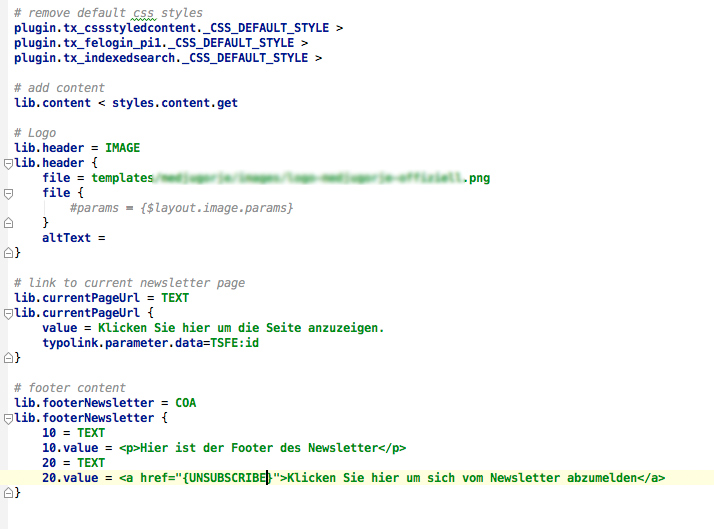
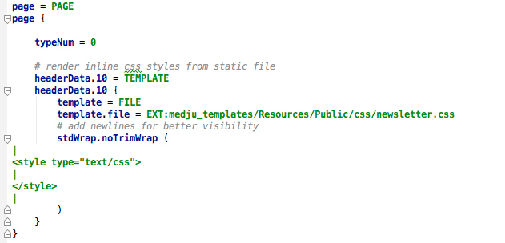

.. ==================================================
.. FOR YOUR INFORMATION
.. --------------------------------------------------
.. -*- coding: utf-8 -*- with BOM.

.. include:: ../Includes.txt

.. _admin-manual:

Administrator Manual
====================

Describes how to manage the extension from an administrator’s point of
view.

Installation
------------

Install extension in extension manager. Include extension typoscript. Set cleverreach api key, wsdl url and url of email detail view of your cleverreach account. (click on the detail view of an already created email, copy url and remove id number)

Copy plaintext template from pixelink_newsletter/Resources/Public/Backend/Templates/NewsletterPlain.txt to your favored place and set template path in typoscript settings. This is basically a .txt file that contains a marker ###CONTENT### for your website content, some custom text like an imprint text.

The newsletter page template should render an absolute link to the newsletter page as well as a unsubscription link. The latter can be set with a cleverreach placeholder {UNSUBSCRIBE}

	Typoscript for newsletter page template

If you wish personal greetings you can set cleverreach placeholders such as  {SALUTATION_FORMAL}

HTML Newsletters should contain inline CSS only. So either render your css file with the TEMPLATE Object or put css in your html template.

	Typoscript for css inline rendering

FAQ
^^^

Possible subsection: FAQ
