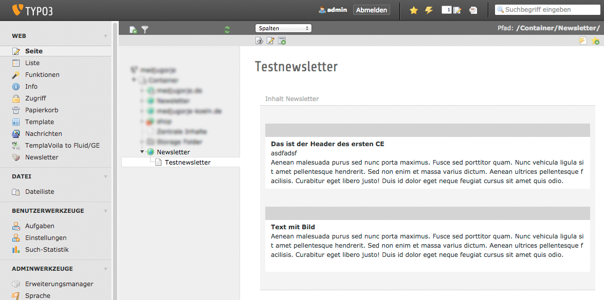
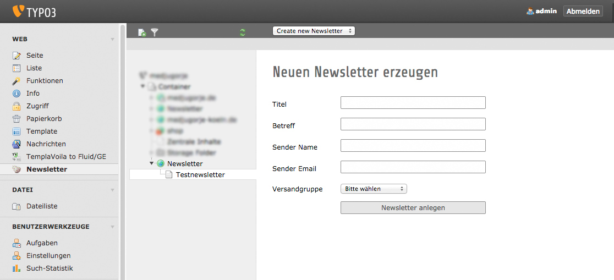
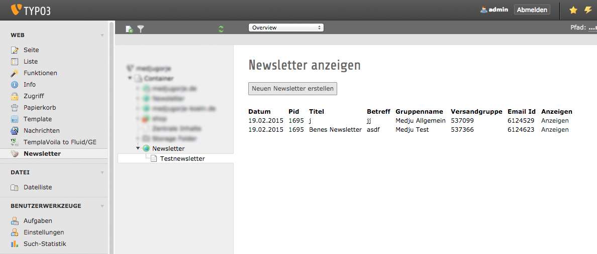

.. ==================================================
.. FOR YOUR INFORMATION
.. --------------------------------------------------
.. -*- coding: utf-8 -*- with BOM.

.. include:: ../Includes.txt

.. _users-manual:

Users manual
============

Create newsletter page
----------------------

Create new page and select your custom newsletter html template. Add content elements in the main column (colPos=0). This page can be anywhere on your site. On the screenshot example all newsletter pages are created underneath the newsletter root-page.

Target group: **Users**

	Default Backend view content elements

Create newsletter
------------------------------

Select the desired newsletter page in pagetree and click on the newsletter submodule of the web module. Select 'create new newsletter' view. Fill out all fields of the form and click "create newsletter".

	Create Newsletter Form View

List all newsletters
-------------------------------

If all works fine a new newsletter is created in your cleverreach account and you will be redirected to the list view. Your newsletter has the pid of your current newsletter page set, but the listview shows all newsletters, independent of the page. If the url of the cleverreach email page is set in typoscript settings, there will be a link to the detail view of your newsletter in the cleverreach account.

	List view of all newsletters

FAQ
^^^

Possible subsection: FAQ
